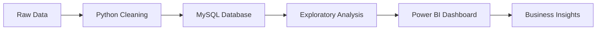

# Banking Analysis Dashboard


<!-- Replace with actual screenshot -->

A comprehensive banking analysis solution that transforms raw client data into actionable insights through data cleaning, exploratory analysis, and interactive visualizations.

## Features

- **Data Processing Pipeline**: Automated cleaning and transformation of banking data
- **Exploratory Data Analysis**: In-depth analysis of client demographics and financial behavior
- **Interactive Dashboard**: Real-time visualization of key banking metrics
- **Client Segmentation**: Identification of high-value customers and risk profiles
- **Performance Tracking**: Monitoring of deposits, loans, and account engagement

## Technology Stack

### Data Processing


### Database


### Visualization


## Data Structure
The dataset contains comprehensive banking information with the following key attributes:

| Category | Key Metrics |
|----------|-------------|
| **Client Info** | Client ID, Name, Age, Gender, Nationality |
| **Accounts** | Checking Accounts, Saving Accounts, Foreign Currency Accounts |
| **Financials** | Bank Deposits, Credit Card Balance, Bank Loans, Superannuation Savings |
| **Relationship** | Loyalty Classification, Banking Contact, Joined Date |
| **Risk Analysis** | Risk Weighting, Properties Owned, Business Lending |

## Implementation Workflow



## Dashboard Features
- **Client Demographics**: Age distribution, geographic analysis
- **Financial Health Metrics**: 
  ```dax
  // Sample DAX measure for engagement accounts
  Total Engagement = 
  SUM('Clients'[Checking Accounts]) + 
  SUM('Clients'[Saving Accounts]) +
  SUM('Clients'[Foreign Currency Account])
  ```
- **Revenue Analysis**: Fee structure performance by client segment
- **Risk Assessment**: Weighted risk scoring across portfolios
- **Relationship Insights**: Loyalty classification trends

## Getting Started

### Prerequisites
- Python 3.9+
- MySQL 8.0+
- Power BI Desktop

### Installation
1. Clone the repository:
   ```bash
   git clone https://github.com/yourusername/banking-analysis-dashboard.git
   ```
2. Set up the Python environment:
   ```bash
   pip install -r requirements.txt
   ```
3. Import database schema into your MySql Database from the csv file.

4. Run the ETL pipeline:
   ```bash
   python BankEDA_(Version_1).py
   ```
5. Open `dashboard.pbix` in Power BI Desktop

## License
This project is licensed under the MIT License - see the [LICENSE](LICENSE) file for details.

---

**Connect with me**: [](your-linkedin-profile) 
[](your-portfolio-link)

> "Without data, you're just another person with an opinion." - W. Edwards Deming
